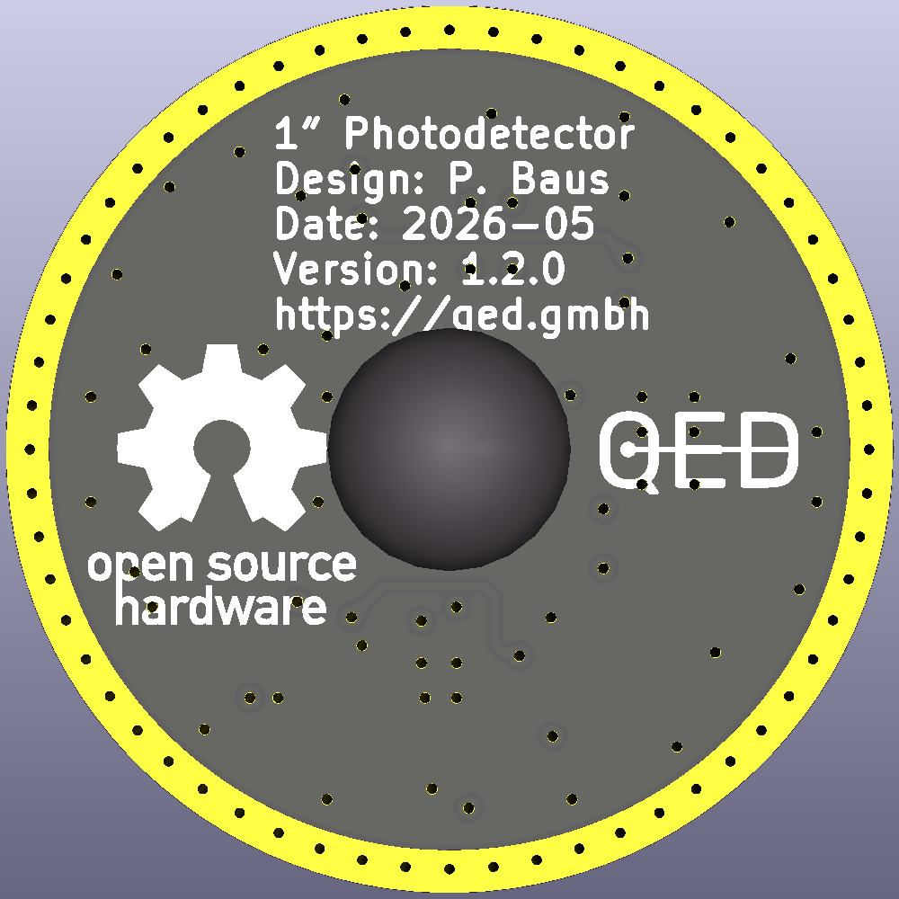
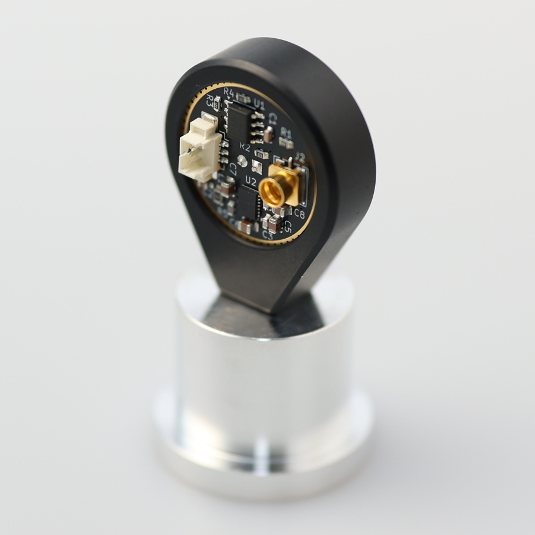

[](https://github.com/Quantum-Electronic-Devices/One-Inch-Photodiode/actions/workflows/ci.yml)
[](https://github.com/Quantum-Electronic-Devices/One-Inch-Photodiode/actions/workflows/datasheet.yml)
# 1″-Photodetector
This repository contains the [KiCad](https://www.kicad.org/) schematics and design files for the [QED 1″-Photodetector](https://quantum-electronic-devices.de/en/products/electronics/1-photodetector/).

<p align="center">
  
  
</p>

## Contents
- [Introduction](#introduction)
- [Datasheet](#datasheet)
- [Design Files](#design-files)
- [Versioning](#versioning)
- [License](#license)

## Introduction
The [QED 1″-Photodetector](https://quantum-electronic-devices.de/en/products/electronics/1-photodetector/) is a circular shaped photodetector with an outer diameter of 25.4 mm and an [Osram SFH 203 photodiode](https://ams-osram.com/products/photodetectors/photodiodes/osram-radial-t1-34-sfh-203) mounted in the centre. It can be easily integrated into 1″ cage systems, such as Thorlabs' 30 mm cage mounts (e.g. the [CP33/M](https://www.thorlabs.com/item/CP33_M)). This makes the photodetector ideal for reliable and sturdy setups that can be quickly assembled for tasks such as laser power monitoring or intensity stabilisation. It has a [TIA](https://en.wikipedia.org/wiki/Transimpedance_amplifier) gain of 10 kV/A and an additional voltage gain of 5. The bandwidth is 8 MHz. The full specifications can be found in the [datasheet](#datasheet).

## Datasheet
The datasheet is available with every release and it lists the most important electrical and mechanical specifications. The latest version can be found [here](../../releases/latest/download/datasheet.pdf). Older versions can be found attached to the respective [release](../../releases).

## Design Files
### For production
The design files required for the PCB production and assembly can be found on the [releases](../../releases) page and include the following resources:

- Schematics as a PDF
- Gerber files
- Pick & place position files
- Bill of materials as a CSV file, as well as an interactive HTML version

The latest revision of those files can be found [here](../../releases/latest).

### For editing
To work on the [KiCad](https://www.kicad.org/) design files, a number of external libraries are needed. Those libraries show up as empty folders in the zip file, because they are not included in the release, but must be downloaded separately from the links given [below](#related-repositories). This can be avoided by checking out the whole repository using git. This way the libraries will be downloaded as well. Use the following command to clone the git repository along with the submodules  using the `--recurse-submodules` flag.
```
git clone --recurse-submodules https://github.com/Quantum-Electronic-Devices/One-Inch-Photodiode.git
```

## Versioning
We use [SemVer](http://semver.org/) for versioning. For the available versions, see the repository's [tags](../../tags).

- MAJOR versions in this context mean a breaking change to the external interface of the hardware like different connectors or functions.
- MINOR versions contain changes to the hardware that only affect the inner workings of the circuit, but otherwise the performance is unaffected.
- PATCH versions do not affect the schematics or invalidate older bill of materials. These changes may include updated components (to replace obsolete parts for example), an updated silkscreen, or fixed typos.

## License
This work is released under the CERN-OHL-W
See [https://ohwr.org/cern_ohl_w_v2.pdf](https://ohwr.org/cern_ohl_w_v2.pdf) or the included LICENSE file for more information.
